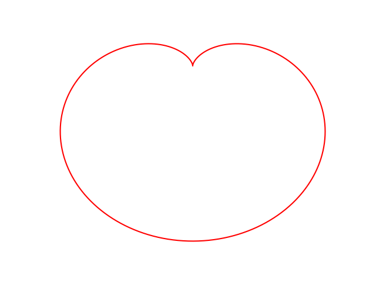

English | [简体中文](/README.zh.md)
# Introduction
Make a cardioid by using python's matplotlib library.
# Demo
| Heart | Heart-Poloar |
|:---:|:---:|
|  |  |
| **Heart-Flat** | **Heart-Gif** |
|  |  |
# Install
```
pip install matplotlib
```
# Equations
## Parametric Equation


## Polar Equation
)
# Usage
1. Git clone
```
git clone https://github.com/XavierJiezou/python-cardioid-matplotlib.git
cd python-cardioid-matplotlib
```
2. Draw a cardioid according to the parametric equation.
```
python python .\example\parametric.py
```
3. Draw a cardioid according to the poloar equation.
```
python .\example\polar.py
```
4. Draw a cardioid dynamicly.
```
python .\example\animate.py 
```
5. Run all that from 1 to 4.
```
python .\main.py
```
# Reference
> [https://en.wikipedia.org/wiki/Cardioid](https://en.wikipedia.org/wiki/Cardioid)
> 
> [https://matplotlib.org/3.2.1/api/_as_gen/matplotlib.animation.FuncAnimation.html](https://matplotlib.org/3.2.1/api/_as_gen/matplotlib.animation.FuncAnimation.html)
> 
> [https://zhuanlan.zhihu.com/p/32380300](https://zhuanlan.zhihu.com/p/32380300)