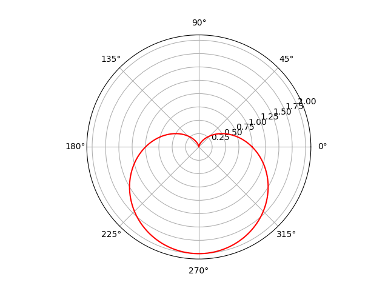

简体中文 | [English](/README.md)
# 简介
用`Python`的`matplotlib`库绘制心形线。
# 演示
| 心-直角坐标 | 心-极坐标系 |
|:---:|:---:|
|  |  |
| **扁点的心** | **动态绘制** |
|  |  |
# 安装
```
pip install matplotlib
```
# 方程
## 参数方程


## 极坐标方程
)
# 用法
1. 克隆仓库。
```bash
git clone https://github.com/XavierJiezou/python-cardioid-matplotlib.git
cd python-cardioid-matplotlib
```
2. 根据参数方程绘制心形线。
```bash
python python .\example\parametric.py
```
3. 根据极坐标方程绘制心形线。
```bash
python .\example\polar.py
```
4. 动态绘制心形线。
```bash
python .\example\animate.py 
```
5. 运行1-4的所有代码。
```bash
python .\main.py
```
# 参考
> [https://en.wikipedia.org/wiki/Cardioid](https://en.wikipedia.org/wiki/Cardioid)
> 
> [https://matplotlib.org/3.2.1/api/_as_gen/matplotlib.animation.FuncAnimation.html](https://matplotlib.org/3.2.1/api/_as_gen/matplotlib.animation.FuncAnimation.html)
> 
> [https://zhuanlan.zhihu.com/p/32380300](https://zhuanlan.zhihu.com/p/32380300)